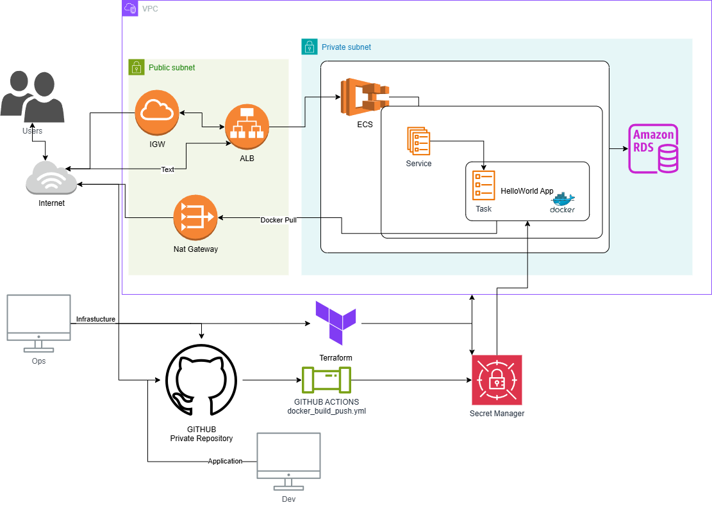

# pagerduty-devops-challenge
Repository dedicated to implement IaaC to deploy ECS cluster and RDS instance for the PagerDuty Take Home Exercise

This was made with Github Actions + AWS + Terraform.

## Requirements
Requirements to deploy:
- AWS CLI installed
- AWS credentials configured
- Terraform installed
- Github Actions enabled
- AWS IAM role with necessary permissions to deploy ECS cluster and RDS instance
- AWS Secret Manager
##  Github Secrets 
- AWS_ACCESS_KEY_ID
- AWS_SECRET_ACCESS_KEY
- AWS_REGION
##  Terraform Configuration Files
- main.tf
- variables.tf
- outputs.tf
##  Terraform Files
- main.tf: This file contains the main configuration for the deployment. It includes the ECS cluster, RDS, ALB, VPC and security groups.
- variables.tf: This file contains the variables used in the main.tf file. It includes:
    - container_image  (image URL used in container_definitions)
    - aws_secret_pull  (ARN of secret with the github token to pull image from ECS)
    - aws_rds_username 
    - aws_rds_password 
    - app_name 
    - branch_name 

> [!IMPORTANT]  
> The terraform_init_plan_deploy.yml file was used to test an automated way to deploy Terraform changes. However, this approach could not be implemented effectively because it requires a shared location to store the terraform.tfstate file. This shared state is essential for tools like GitHub, GitLab, or any CI/CD system to understand the current state of the infrastructure and apply updates correctly.

> [!IMPORTANT]  
> This infrastructure can be improved in various ways, depending on several factors such as the tools used by your company or homelab, how you want to manage secrets, and the types of resources available.

Architecture Diagram

Workflow Diagram
